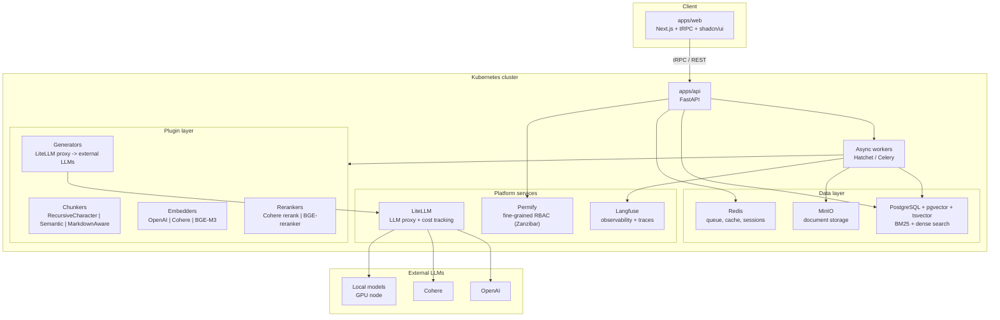

# Architecture overview

Краткий обзор компонентов RAG-Platform. Архитектурные решения — в [docs/adr/](adr/).

## Component diagram

## Key flows

**Ingest:** Web -> API -> Worker -> Chunker -> Embedder -> PG (chunks + vectors) + MinIO (raw file)

**Experiment run:** Web -> API -> Worker -> ordered plugin chain -> PG (run_results + metrics) -> Langfuse (traces)

**Eval:** Worker -> RAGAS -> faithfulness / answer_relevance / context_precision / context_recall -> composite score -> experiment leaderboard

**Auth check:** API -> Permify.check(user, action, resource) -> allow / deny

## ADR index

| # | Решение |
|---|---|
| [0001](adr/0001-plugin-architecture.md) | Plugin-архитектура: abstract class + params_schema + entrypoints |
| [0002](adr/0002-authz-permify-internal.md) | Авторизация: Permify internal, Zanzibar-model |
| [0003](adr/0003-multi-tenant-from-mvp.md) | Multi-tenancy: shared schema, organization_id |
| [0004](adr/0004-k8s-only-no-compose.md) | Dev/prod: kind + Tilt / k3s + Helm, без docker-compose |
| [0005](adr/0005-pipeline-as-a-service-fixed-score.md) | Experiment model: декартово произведение + composite score |
