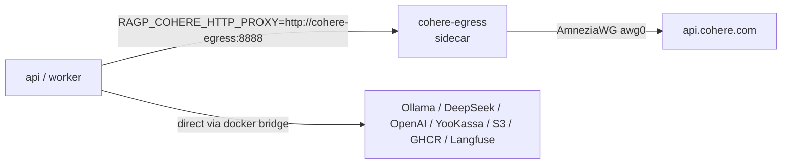

# Cohere VPN sidecar (AmneziaWG)

## Why

`api.cohere.com` and `api.cohere.ai` are blocked from RU IPs. The pilot host
runs in RU, so cohere reranker / embedder calls would fail with TCP reset.
We do **not** want to push every outbound request through a VPN — Ollama,
DeepSeek, OpenAI, YooKassa, Selectel S3, GHCR, Langfuse all stay direct.

The fix is selective routing: a sidecar container runs an AmneziaWG client
plus an HTTP forward proxy, and only the cohere SDK calls inside `api` and
`worker` point at it via `RAGP_COHERE_HTTP_PROXY`.

AmneziaWG is used (not vanilla WireGuard) because the upstream provider's
config is `protocol_version=2` with obfuscation fields `Jc/Jmin/Jmax`,
`S1-S4`, `H1-H4`, `I1`. Standard `wireguard-tools`/`wg-quick` cannot parse
them.

## How it works



Inside `cohere-egress`:

  1. `amneziawg-go` (userspace AmneziaWG implementation) brings up `awg0`
     from `/etc/amneziawg/awg0.conf`.
  2. `tinyproxy` listens on `0.0.0.0:8888` and forwards `CONNECT :443`
     requests upstream. With `AllowedIPs=0.0.0.0/0` everything goes through
     `awg0`.
  3. `iptables -t mangle -A PREROUTING -i eth0 -j MARK --set-mark 0x100`
     plus `ip rule add fwmark 0x100 lookup main pref 100` keep the
     **return path** to docker-bridge clients on `eth0`. Without this,
     replies on the `:8888` socket would be routed back into the tunnel
     and dropped.

If `awg0.conf` is absent (e.g. local smoke or CI image build) the
entrypoint skips the VPN stage and only runs `tinyproxy`. Cohere calls
then fail with a network error, which the `api` plugins handle as
documented below.

## Plugin behaviour

| Plugin              | Network error after retries        |
| ------------------- | ---------------------------------- |
| Cohere reranker     | Fall back to `candidates[:top_k]`  |
| Cohere embedder     | Re-raise (silent fallback would corrupt the vector index) |

Both plugins retry three times with exponential backoff (0.5/1.0/2.0s) on
`httpx.ConnectError` / `httpx.ReadTimeout` / `httpx.ConnectTimeout`. When
`RAGP_COHERE_HTTP_PROXY` is empty the cohere SDK keeps using its own
internal httpx client and a direct DNS path (no behaviour change).

## Configure

Two pieces of state live outside the repo:

  * **GitHub secret `COHERE_AMNEZIA_CONF`** — the raw AmneziaWG `.conf`
    text (the file produced from the `vpn://` URI Amnezia hands you, with
    obfuscation fields preserved). The deploy workflow materialises this
    onto the host as `/opt/rag-p/cohere.amnezia.conf` with mode 600 and
    bind-mounts it read-only into the sidecar.
  * **Repository var `RAGP_COHERE_HTTP_PROXY`** (optional) — defaults to
    `http://cohere-egress:8888`. Set to empty to disable proxying entirely
    (cohere will then go direct and likely fail from RU IPs).

## Rotate the AmneziaWG config

  1. Update `COHERE_AMNEZIA_CONF` in GitHub repo secrets.
  2. Re-run the `Deploy to Compose production` workflow (or push to
     `main` after CI). The workflow rewrites
     `/opt/rag-p/cohere.amnezia.conf` and `docker compose up -d` recreates
     the sidecar.
  3. Verify on the host:

     ```sh
     ssh $REMOTE "docker compose -f /opt/rag-p/compose.prod.yml --env-file /opt/rag-p/.env exec -T cohere-egress awg show"
     ```

     A successful handshake shows `latest handshake: <recent>` and a
     non-zero `transfer:` line.

## Disable the proxy

Set `RAGP_COHERE_HTTP_PROXY=""` in `/opt/rag-p/.env` and run
`docker compose -f /opt/rag-p/compose.prod.yml --env-file /opt/rag-p/.env up -d api worker`.
Cohere calls will then go direct; expect 403 / TCP reset from RU IPs.

## Diagnose

  * Inspect logs:

    ```sh
    docker compose -f /opt/rag-p/compose.prod.yml --env-file /opt/rag-p/.env logs --tail=100 cohere-egress
    ```

    `awg-quick up` output should be present, then a `[cohere-egress]`
    line announcing tinyproxy.

  * Smoke test the proxy from inside the api container:

    ```sh
    docker compose -f /opt/rag-p/compose.prod.yml --env-file /opt/rag-p/.env exec -T api \
        curl -x http://cohere-egress:8888 -fsS -I https://api.cohere.com
    ```

    `200 OK` or `401 Unauthorized` both mean the proxy + VPN are working
    (401 just means the request reached cohere without an auth header).

  * Inspect the AmneziaWG interface:

    ```sh
    docker compose -f /opt/rag-p/compose.prod.yml --env-file /opt/rag-p/.env exec -T cohere-egress awg show awg0
    ```

## Known limits

  * The sidecar image is built on the host (not pushed to GHCR) on every
    deploy. If the AmneziaWG repos go down at build time, the deploy
    fails. Pinning to a specific commit is a future improvement.
  * Healthcheck only probes `:8888`; an unhealthy AmneziaWG handshake
    still shows the sidecar as healthy. Cohere SDK errors then surface
    via the api plugins (graceful for reranker, exception for embedder).
